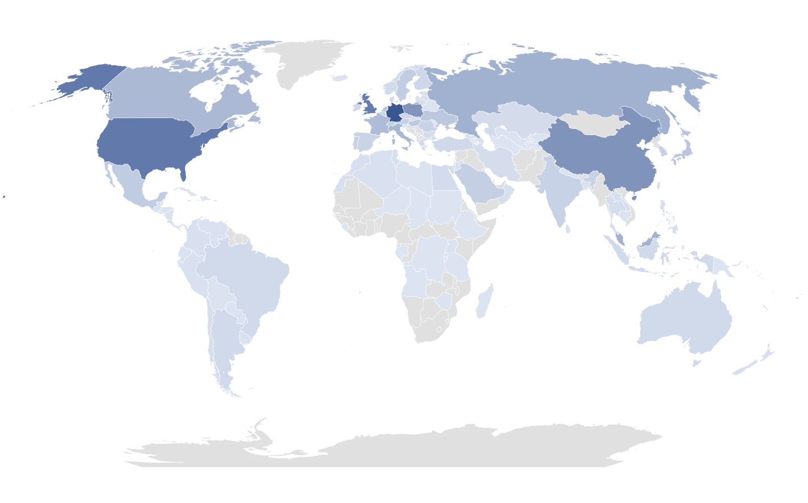
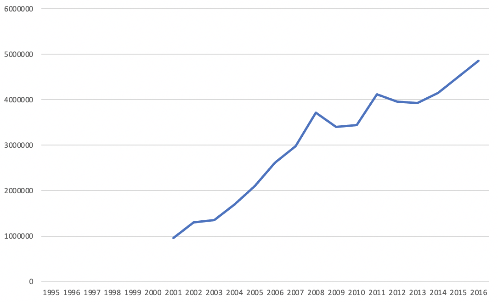

# Project 1 - Exploratory

## Prospectus

For this exploratory project, I will be exploring which countries have citizens that are more likely to travel internationally with the departures tourism data provided by [Our World in Data](https://ourworldindata.org/tourism). The following variables will be used: Entity, Year, Departures, and GDP per Capita, PPP. 

## Sketches

Below are a brief descriptions of the skectches for the data visualizations:

- Visualize the number of departures per year via a time series chart for each country
- Choropleth map visualizing the most to least amount of departures per country.

Below are the possible charts

