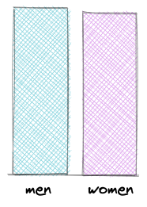
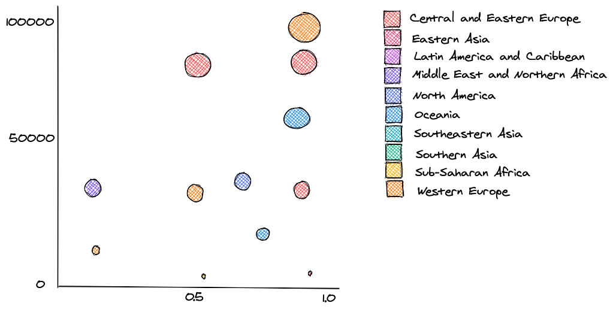
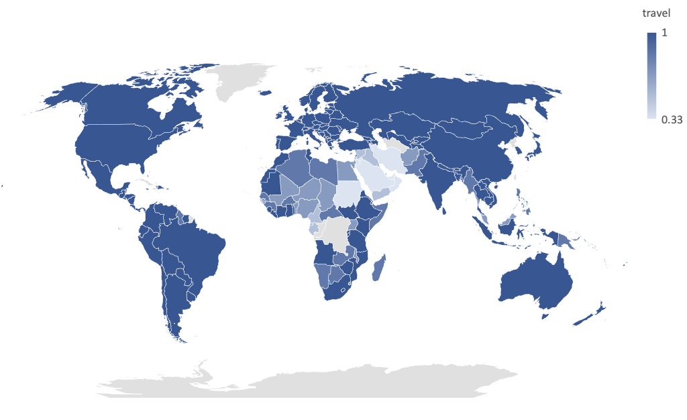

# Project 1 - Exploratory

## Prospectus

For this narrative project, I will be exploring the representation of gender through the lens of tourism and travel with the data from the Gender Data Portal through [World Bank](https://www.worldbank.org/en/data/datatopics/gender). The primary variables will be observed per country: Gender, GDP per Capita, with possible variables from the [World Happiness Report](https://worldhappiness.report/ed/2020/) such as Freedom.

## Sketches

Below are a brief descriptions of the skectches for the data visualizations:

- A bar chart to compare the male to female ratio based on the world population.
- Visualize a variable against GDP per Capita through a scatterplot.
- A choropleth map visualizing the most to least amount women per country.

### Below are the possible charts

